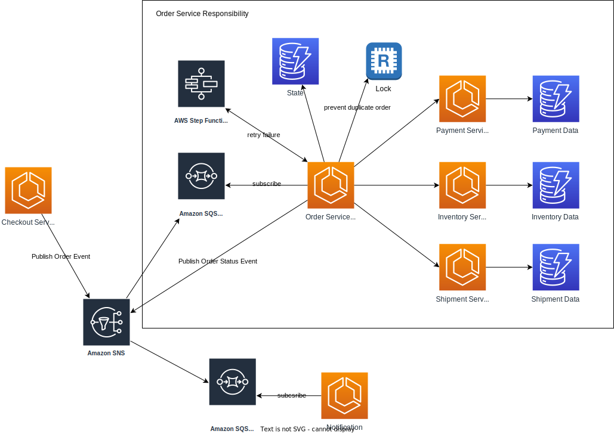

# Essay

Given 2 or more different services, please design a system for all services to maintain up-to-date data without sharing their databases — for example, concrete use case: user & billing services.
- Then you have to explain to us how the data flows and how the data sync between databases.
- And what stacks that you recommend,and why?

_Hints and Tips!_
- You choose which methodology you use,such as BFF,Hexagonal
Architecture, Event-driven Architecture, etc.
- You also can draw a simple architecture diagram by using external websites like plantuml, lucid.app, etc. And upload the image here with your explanation.

Good luck!

---

# Answer
## Context
Given e-commerce scenario that has the following services: _checkout, payment, inventory and shipment_. With __Database-per-Service__

## Pattern: Saga
### 1. Pure Event-Driven (Choreography-based) approach

#### Transaction Flow ####

Checkout emits an _OrderCreatedEvent_, payment subscribes to that event and then emits _PaymentCreatedEvent_, inventory subcribes to _PaymentReceivedEvent_ and then emits _InventoryFetchedEvent_, and so on. Each service will save the state in their own database.

#### Compensating Transaction Flow ####

To ensure _up-to-date_ data, each service should subcribe to the _compensating transaction event_ and update their database.

This approach is fast to implement in the beginning and adding another service is relatively easy, but it yields technical debt.

The problem with pure Event-Driven are there is no clear responsibility about the event flow. If the bussiness logic changes and we need to adjust the sequence of events, we need to make changes to the impacted services. And if the service belongs to other teams then we will need to coordinate with them and this might take more time. 

For example: after OrderCreated, we should fetch the Inventory first before make the payment:

### 2. Combine Command-Driven & Event-Driven approach
To solve the Event-Driven problems stated above, we can add _Order Service_ to orchestrate the order flow:

The _Order Service_ will serve as __Domain Logic__ and __Orchestrator__. While _Payment Service_ _Inventory Service_ and _Shipment Service_ __do not need to know__ about the bussiness flow and to which service they have to subscribe to. When the bussiness logic changes, we can change the _Order Service_ without changing the other services.

The _Order Service_  has its own database to save the state of the order process and it has the responsibility to maintain the _up-to-date_ data to other services.

Notes: __Command__ here is protocol agnostic, it doesn't have to be _service-to-service_ connection but can be using event (command-in-disguise), for example if we have to refactor the first approach that rely heavily on Message Broker (Kafka, Nats, etc) we can still use event as a command. 

But if it's a new project, for command based connection, I would prefer to use _service-to-service_ (REST, rpc, etc.) to make it clear and should be faster.

Here is the full architecture:

## Summary
I follow _Domain-Driven Design_'s principles and I would combine _Command-Driven (Orchestration)_ and _Event-Driven (Choreography)_ based on the __Responsibility__, where _Order Service_ is responsible to handle the bussiness logic and maintain the _up-to-date_ data.

Thank you!